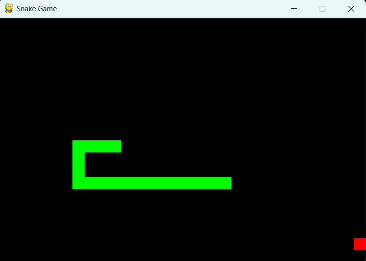

# Snake Game (Jogo da Cobrinha)

* O jogador controla uma cobra que cresce ao comer a comida.
* O desafio é evitar colidir com as bordas ou consigo mesma.
* **Aprendizado**: manipulação de sprites e colisões.

  

